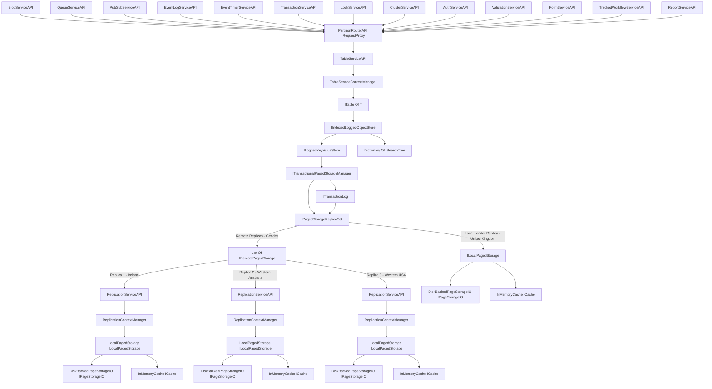

# Project Overview
This project includes a number of classes and interfaces that work together to implement a transactional paged storage system with support for indexing and query operations. Here's a high-level overview of how these components interact.

# Core Classes
## DiskPagedStorageIO
This class is responsible for handling the direct input/output operations with the disk. It provides the basic functionality for reading from and writing to disk.

## FileMetaData
The FileMetaData class is used for maintaining the metadata associated with each file. Metadata might include details like the file name, size, creation date, map of pages.

## LocalPagedStorage and RemotePagedStorage
These classes implement the IPagedStorageProvider interface for local and remote environments respectively. They handle the creation, retrieval, and deletion of pages from the corresponding storage systems.

## Cache
### InMemoryCache
The InMemoryCache class is a simple implementation of an in-memory cache. It temporarily stores data that has been recently read from or written to disk, improving the performance of subsequent read operations.

### OnFileSystemCache
The OnFileSystemCache class is a simple implementation of a disk-based cache that is swappable into any ICache dependency. It temporarily stores data that has been recently read from or written to disk with a much lower memory requirement than the InMemoryCache, improving the performance of subsequent read operations.

## Transactional Storage
### TransactionalPagedStorageManager
This class handles the management of pages in a transactional manner. It utilizes the ITransactionLogProvider to log operations and support transaction rollbacks.

### TransactionalPageUpdate
The TransactionalPageUpdate class represents an update operation within a transaction. It includes details of the pages that were updated during the transaction.

### TransactionLog
This class provides functionality to manage a log of transactions. It supports operations like adding new entries to the log, updating the status of a log entry, and rolling back transactions.

## Indexed Storage
### BinarySearchTree + BinarySearchTreeNode
These classes implement a binary search tree for indexing purposes. The BinarySearchTree class represents the tree itself, while the BinarySearchTreeNode represents individual nodes within the tree.

### TableOfT
The TableOfT class represents a table in our database. It uses binary search trees to create indexes for each property of the T object that it stores.

## Query Handling
### ConjunctionOperator, QueryOperator, SortDirection, WhereExpressionNode
These classes are used to represent and process SQL-like query expressions. They include classes for different types of operators (ConjunctionOperator, QueryOperator), sorting directives (SortDirection), and the structure of WHERE clause expressions (WhereExpressionNode).

## Security
### PrincipalData, OAuthToken, TokenCheckMiddleware
These classes are related to security and authentication. 
PrincipalData represents the security principal of a user, OAuthToken represents a token returned by an OAuth authentication process, and TokenCheckMiddleware is a middleware that checks the validity of the token in the request.

It's really a sample of my thoughts on building distributed, reliable services to support a business in it's critical operations. 

Behind the scenes the following core fundamental services will be created
--------------------
- TableStorageService -> Code Complete
- ReplicaTargetService -> Code Complete
- QueueService -> 
- PubSubService -> 
- AuthorizationService -> 
- BlobStoreService 
- ClusterService
- EventLogService
- EventTimerService
- LocalisationService
- LockService
- BusinessRuleService

- RequestPartitionProxyRoutingService -> Will use YARP to route to remote replicas for scale out and availability.

The following * business application services * will also exist
------------------
- FormService (Generates HTML Forms for list and interaction with business objects)
- ReportService (Generates Static HTML Reports)
- HierarchyService (Understands the semantics of your business hierarchies (For example "Get me all of the retail customers in the north east of europe"))
- TrackedWorkflowService (Allows for long-running disconnected tasks, or ones that require approvals or pipelines)
- ValidationService (Validates that your business objects are safe according to business rules). 

You will also find sample POCOs that are relevant to most businesses and scenarios (currently in the TableServiceAPI project) 
- Person -> Complete
- Partner -> Complete
- ProductMaterial -> Complete
- StockKeepingUnit -> Complete
- PricingCalculation -> Complete
- BillOfMaterial -> Complete
- BillOfMaterialComponent -> Complete
- UnitOfMeasure -> Complete
- PurchaseRequisition 
- PurchaseOrder
- PurchaseShipNotification
- PurchaseInvoice
- PurchaseRemittance
- SalesQuotation
- SalesOrder
- SalesDispatch
- SalesReceiptConfirmation
- SalesInvoice
- SalesInvoicePayment
- Ledger
- LedgerAccount
- LedgerCostCentre
- LedgerPayment

Supporting Enums
- StructureType (Pricing Condition Structures - Fixed, Percentage, PerSKUSold, ListPrice) -> Complete
- PartnerType (Customer, Supplier, Shipping, Billing, Etc.) -> Complete

The core premise here is to make these services extensible and interoperable and to provide a sensible sample of what these services might look like in a typical line of business application. 

The overall system architecture document, in order to create a globally resilient transactional storage system with synchronous commit.

I will also provide deployment samples and config files, with dockerfiles and command line scripts, for each service for a turnkey scripted deployment.
