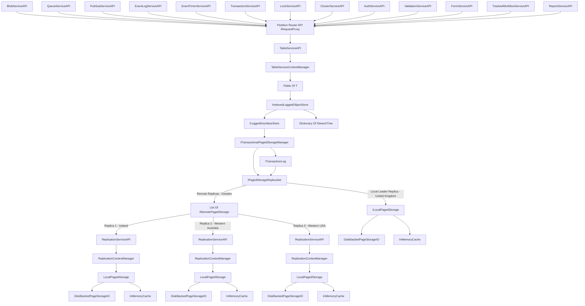

# DistributedServices
A sample of my thoughts on building distributed, reliable services to support a business in it's critical operations
Includes Tabular indexed distributed Storage, Synchronous Replication of storage, Transaction Management and log Replay, Clustering and other challenges. 
---------------------------------------------------------------------------------

The following modules come together under the covers to make this all work, each with appropriate Interfaces and DI setup modules
------------------------
- DiskPagedStorageIO
- FileMetaData
- LocalPagedStorage
- RemotePagedStorage
- InMemoryCache
- IndexedLoggedObjectStore
- LoggedKeyValueStore
- PagedStorageReplicaSet
- TransactionalPagedStorageManager
- TransactionalPageUpdate
- TransactionLog
- BinarySearchTree + BinarySearchTreeNode
- TableOfT
- PatchInstruction
- ConjunctionOperator
- QueryOperator
- SortDirection
- WhereExpressionNode
- PrincipalData
- OAuthToken
- TokenCheckMiddleware

Behind the scenes the following core fundamental services should exist
--------------------
- TableStorageService -> Code Complete
- ReplicaTargetService -> Code Complete
- QueueService -> 
- PubSubService -> 
- AuthorizationService -> 
- BlobStoreService 
- ClusterService
- EventLogService
- EventTimerService
- LocalisationService
- LockService
- BusinessRuleService

- RequestPartitionProxyRoutingService -> Will use YARP to route to remote replicas

The following business application services will also exist
------------------
- FormService (Generates HTML Forms for list and interaction with business objects)
- ReportService (Generates Static HTML Reports)
- HierarchyService (Understands the semantics of your business hierarchies (For example "Get me all of the retail customers in the north east of europe"))
- TrackedWorkflowService (Allows for long-running disconnected tasks, or ones that require approvals or pipelines)
- ValidationService (Validates that your business objects are safe according to business rules). 

You will also find sample POCOs that are relevant to most businesses and scenarios (currently in the TableServiceAPI project) 
- Person -> Complete
- Partner -> Complete
- ProductMaterial -> Complete
- StockKeepingUnit -> Complete
- PricingCalculation -> Complete
- BillOfMaterial -> Complete
- BillOfMaterialComponent -> Complete
- UnitOfMeasure -> Complete
- PurchaseRequisition 
- PurchaseOrder
- PurchaseShipNotification
- PurchaseInvoice
- PurchaseRemittance
- SalesQuotation
- SalesOrder
- SalesDispatch
- SalesReceiptConfirmation
- SalesInvoice
- SalesInvoicePayment
- Ledger
- LedgerAccount
- LedgerCostCentre
- LedgerPayment

Supporting Enums
- StructureType (Pricing Condition Structures - Fixed, Percentage, PerSKUSold, ListPrice) -> Complete
- PartnerType (Customer, Supplier, Shipping, Billing, Etc.) -> Complete

The core premise here is to make these services extensible and interoperable and to provide a sensible sample of what these services might look like in a typical line of business application. 

The overall system architecture document, in order to create a globally resilient transactional storage system with synchronous commit.

I will also provide deployment samples and config files, with dockerfiles and command line scripts, for each service for a turnkey scripted deployment.
